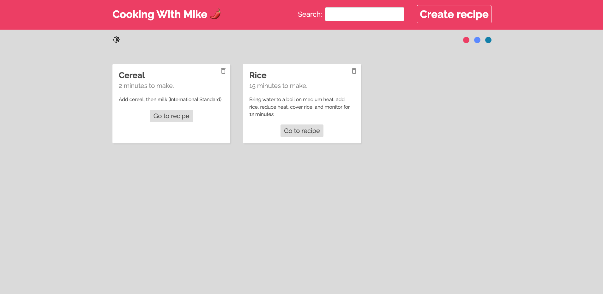

# Cooking with Mike 🌶
## Another RealTime CRUD webapp. 
This is a CRUD webapp developed with React / Firebase.

<h2 align="center">
  
  
   
</h2>

## Features 💡
⚡️ Dark Mode Theme (Using React Context)\
⚡️ React Router\
⚡️ Styled with CSS\
⚡️ Optimized with Parcel\
⚡️ Well organized backend

To view the current webpage, **[click here](https://mikeguijarro.herokuapp.com/)**

## Technologies used 🛠️
- [Firebase - Realtime DB](https://firebase.google.com/products/realtime-database) - Backend service for realtime data sync
- [React Router](https://reactrouter.com/) - Standard library for routing
- [CSS](https://developer.mozilla.org/en-US/docs/Learn/CSS/First_steps/What_is_CSS/) - Style sheet language used for describing our UI
- [React Context](https://reactjs.org/docs/context.html) - Method that pass props from parent to child component (In a very cool way)

